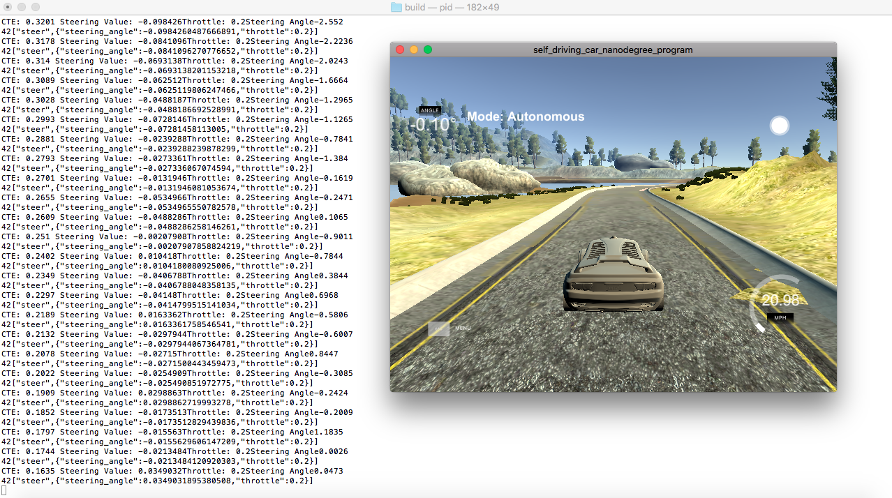

# PID controller
This Project is the ninth task (Project 4 of Term 2) of the Udacity Self-Driving Car Nanodegree program. The main goal of the project is to implement PID controller in C++ to steer the self driving car around the track in a [Simulator](https://github.com/udacity/CarND-PID-Control-Project/releases) v. 0.1.1.

The project was created with the Udacity [Starter Code](https://github.com/udacity/CarND-PID-Control-Project).

## About PID controller

A PID (Proportional, Integral, Derivative) controller is a control loop feedback controller which is widely used in different control systems.

Error is an input variable for the controller:

_cte = desired_state - measured_state_

With the proportional band (_P_) only, the PID controller output is proportional to the cte. It takes into account only the present value of cte. Thanks to this part of controller, it is able to steer in the correct direction.

Integral term (_I_) takes into account the integral of cte over the past time. It is used to reduce systematic bias. 

With derivative (_D_) part, the controller output is proportional to the rate of change of cte (its derivative). The parameter is used to reduce overshooting and dump oscillations caused by the _P_.

## Tuning Process
The parameters were tuned using the Ziegler Nichols Method. Keeping Kd = 0 and Ki = 0, Kp has to be increased incrementally till the response of the vehicle reaches marginal stability i.e. the response oscillates with a constant amplitude. This gain Kp is termed as Ku or ultimate gain and the period of oscillation is called Tu. Then the formula for a PID controller is given by:
Kp = 0.6 Ku;
Ki = Kp * 2 / Tu;
Kd = Kp * Tu / 8;

Due to inability to calculate Tu accurately, an approximation was made for the value and then the calculated Kp, Ki and Kd were tuned based on trial and error.

## Dependencies

* cmake >= 3.5
 * All OSes: [click here for installation instructions](https://cmake.org/install/)
* make >= 4.1
  * Linux: make is installed by default on most Linux distros
  * Mac: [install Xcode command line tools to get make](https://developer.apple.com/xcode/features/)
  * Windows: [Click here for installation instructions](http://gnuwin32.sourceforge.net/packages/make.htm)
* gcc/g++ >= 5.4
  * Linux: gcc / g++ is installed by default on most Linux distros
  * Mac: same deal as make - [install Xcode command line tools]((https://developer.apple.com/xcode/features/)
  * Windows: recommend using [MinGW](http://www.mingw.org/)
* [uWebSockets](https://github.com/uWebSockets/uWebSockets) == 0.13, but the master branch will probably work just fine
  * Follow the instructions in the [uWebSockets README](https://github.com/uWebSockets/uWebSockets/blob/master/README.md) to get setup for your platform. You can download the zip of the appropriate version from the [releases page](https://github.com/uWebSockets/uWebSockets/releases). Here's a link to the [v0.13 zip](https://github.com/uWebSockets/uWebSockets/archive/v0.13.0.zip).
  * If you run OSX and have homebrew installed you can just run the ./install-mac.sh script to install this
* Simulator. You can download these from the [project intro page](https://github.com/udacity/CarND-PID-Control-Project/releases) in the classroom.

## Basic Build Instructions

1. Clone this repo.
2. Make a build directory: `mkdir build && cd build`
3. Compile: `cmake .. && make`
4. Run it: `./pid`. 

## Editor Settings

We've purposefully kept editor configuration files out of this repo in order to
keep it as simple and environment agnostic as possible. However, we recommend
using the following settings:

* indent using spaces
* set tab width to 2 spaces (keeps the matrices in source code aligned)

## Code Style

Please (do your best to) stick to [Google's C++ style guide](https://google.github.io/styleguide/cppguide.html).

## Hints!

* You don't have to follow this directory structure, but if you do, your work
  will span all of the .cpp files here. Keep an eye out for TODOs.
  
  Results:
  

